# Architecture

```mermaid
flowchart LR
  CSV[Raw CSV / synthetic fixture] --> ETL[Validated Python ETL]
  ETL --> Clean[Processed CSV and audit]
  Clean --> Loader[Dedicated loader account]
  Loader --> DB[(MySQL star schema)]
  DB --> Repo[Read-only repository]
  Clean -. explicit development mode .-> Repo
  Repo --> Analytics[Pandas analytics and sklearn / XGBoost]
  Analytics --> Service[Service operations]
  Service --> API[FastAPI and Pydantic]
  API --> UI[React TypeScript Plotly]
  Service --> Context[Restricted evidence context]
  Context --> Groq[Groq recommendation]
  Groq --> API
```

The API is read-only except a stateless Copilot POST. It never executes generated code or
SQL. Repository filters are allowlisted and bound as parameters. MySQL failures return
503 rather than silently switching data sources. The CSV mode exists for reproducible local
development before MySQL credentials are available. `/health` is a liveness endpoint,
not a database readiness check; `/api/dashboard/overview` exercises the data path.

Analytics functions accept data frames and are independent of HTTP. Models are fitted on
the filtered snapshot to keep results coherent. This is suitable for a portfolio-size
dataset; large deployments should precompute/version models, materialize aggregates and
cache by dataset version plus filters. Currently the repository loads the filtered facts
into memory, and pagination is applied after aggregation. Do not call this billion-row-ready.

Local binding is loopback. Authentication, authorization and per-user rate limits must be
added at the gateway before exposing this service publicly. Database users should have
separate ingestion and SELECT-only roles. Server logs can contain internal diagnostics;
HTTP responses contain only a generic error. Do not publish logs or .env files.
